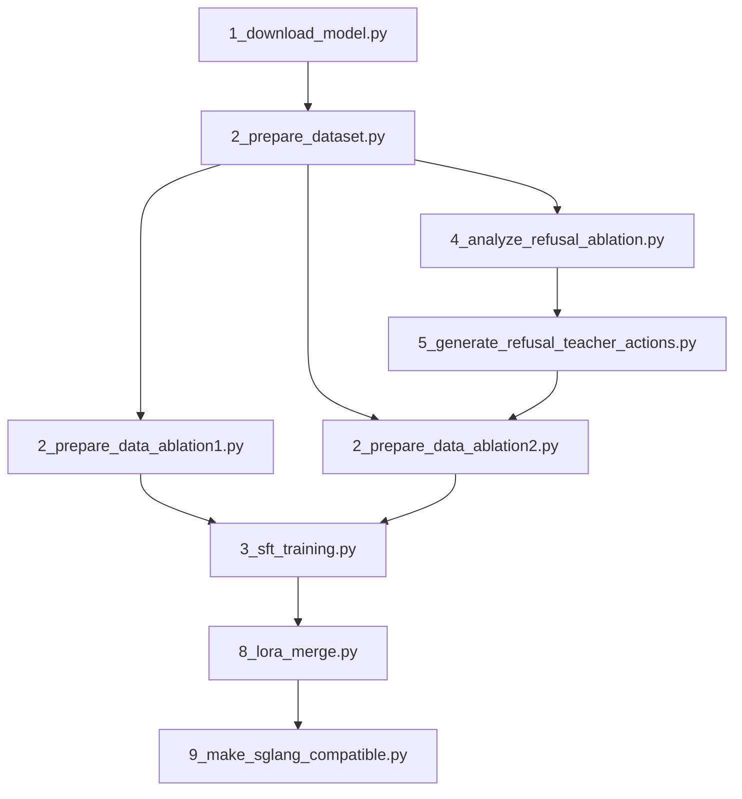

# 项目框架与实验流程

## 目录框架

```text
configs/
  sft_config.yaml
scripts/
  1_download_model.py
  2_prepare_dataset.py
  2_prepare_data_ablation1.py
  2_prepare_data_ablation2.py
  3_sft_training.py
  4_analyze_refusal_ablation.py
  5_generate_refusal_teacher_actions.py
  8_lora_merge.py
  9_make_sglang_compatible.py
  10_shuffle_tool_schema.py
  11_filter_retokenize_processed.py
  utils/
docs/
  PROJECT_FLOW.md
  ABLATION2_DATA_DESIGN.md
  BFCL_SGLANG_COMPATIBILITY.md
```

已清理内容：

- 删除 `main.py`：uv 初始化占位文件，不参与训练流程。
- 删除 `run_pipeline.sh`：调用了已不存在的数据脚本，容易误跑长流程。
- 删除 `test/deepseek.py`、`test/upload_model_modelscope.py`、`test/test_single.py`：临时调试脚本，其中两个包含明文 token 风险。
- `tmp_*` 脚本改名为 `4_analyze_refusal_ablation.py` 和 `5_generate_refusal_teacher_actions.py`。
- `abalation` 拼写统一修正为 `ablation`，包括脚本名、日志名和新配置路径。

## 主流程



## 数据处理流程

### 结构化数据

`scripts/2_prepare_dataset.py` 的 `prepare_dataset()` 从 `Team-ACE/ToolACE` 读取原始数据，核心步骤：

- `first_user_assistant()` 裁剪第一轮 user + assistant。
- `find_tool_json_block()` 从 system 中定位工具 JSON。
- `split_system_and_tools()` 拆出 system prompt 和 tools。
- `build_prompt()` 手写 Llama chat template，避免 tokenizer 自动注入日期。
- 统计 `tool_count`、`tool_type`、`refusal`、prompt token 长度。
- 删除超过 `training.max_seq_length` 的样本。

输出：

- `data/tool_ace_processed`
- `data/tool_ace_processed/sample_prompts.txt`
- `data/tool_ace_processed/dataset_report.md`
- `data/tool_ace_processed/dataset_report.json`

### ablation1 数据

`scripts/2_prepare_data_ablation1.py` 的 `prepare_ablation_data()` 读取 `data/tool_ace_processed`。

实验逻辑：

- 固定 train/eval split，比例来自 `data.validation_split_percentage`。
- train 内抽取 20% 可扰动样本。
- eval 内抽取 50% 可扰动样本。
- 可扰动条件：`tool_type=json`、`tool_count>=1`、`refusal=0`、存在带 description 的参数。
- `rewrite_schema()` 打乱 tool schema 字段、参数顺序、`required` 顺序，并把参数名改为 `param_XXXX`。
- `rewrite_assistant_parameters()` 同步 assistant function-call 中的参数名。
- `tokenize_for_sft()` 生成 `input_ids`、`attention_mask`、assistant-only `labels`。

输出：

- `data/train/train_ablation1_parameter`
- `data/eval/eval_ablation1_parameter`
- `data/ablation1/metadata.json`

### ablation2 数据

`scripts/2_prepare_data_ablation2.py` 的 `prepare_ablation_data()` 构造参数名、函数名和 refusal teacher 混合实验。

未扰动全集由三类样本组成：

- `a`：`data/tool_ace_processed` 中 `tool_count>=1`、`tool_type=json`、`refusal=0` 的非 refusal 样本。
- `b`：`data/ablation_refusal_teacher_deepseek/dataset` 中的 teacher refusal description。
- `c`：`data/tool_ace_processed` 中 `refusal=1` 且 `tool_count=0` 的原始 refusal 样本。

扰动比例：

- train 内 `a` 类可扰动样本：15% 参数名、10% 函数名、5% 参数+函数。
- eval 内 `a` 类可扰动样本：50% 参数+函数。
- 全部扰动样本都会打乱 schema 字段、参数顺序和 `required` 顺序。

关键函数：

- `load_ablation1_helpers()` 复用 ablation1 的 prompt、label 和参数改写逻辑。
- `rewrite_function_names()` 改写 tools 中的函数名。
- `rewrite_assistant_function_names()` 同步 assistant function-call。
- `normalize_refusal_teacher_dataset()` 只保留 teacher JSON 顶层 `description` 或 `teacher_description` 作为 assistant response。

输出：

- `data/train/train_ablation2_param_func_refusal_teacher`
- `data/eval/eval_ablation2_param_func_refusal_teacher`
- `data/ablation2/metadata.json`

### ablation3 数据

ablation3 不生成新数据，复用 ablation2 的 train/eval 数据。它只改变训练参数，用于比较 LoRA rank 提升的影响。

## 训练流程

`scripts/3_sft_training.py` 的 `train_sft()` 执行 LoRA SFT：

- `load_experiment_config()` 读取 `configs/sft_config.yaml` 并应用 `experiments.active` profile。
- `resolve_model_path()` 优先加载 `models/pretrained/AI-ModelScope/Llama-3.2-1B-Instruct`。
- `pick_attention_implementation()` 优先使用 `flash_attention_2`，否则回退 `sdpa`。
- `align_model_token_ids()` 显式对齐 tokenizer/model 的 special token id。
- `LossOnlySFTTrainer` 避免 eval 阶段保存 logits，降低 8GB GPU 显存压力。

当前公共训练参数：

| 参数 | 值 |
| --- | --- |
| epochs | 3 |
| train batch size | 2 |
| eval batch size | 2 |
| gradient accumulation | 24 |
| effective batch size | 48 |
| learning rate | `1.0e-4` |
| scheduler | `cosine` |
| warmup steps | 17 |
| max seq length | 1024 |
| optimizer | `paged_adamw_8bit` |
| precision | bf16 优先，必要时 fp16 |
| gradient checkpointing | true |
| save/eval steps | 46 |
| seed | 42 |

## 实验 profile

| profile | 数据 | 输出目录 | LoRA |
| --- | --- | --- | --- |
| `baseline` | `data/train/train_baseline` / `data/eval/eval_baseline` | `models/checkpoints/sft_toolace_baseline` | r16 alpha32 |
| `ablation1` | `data/train/train_ablation1_parameter` / `data/eval/eval_ablation1_parameter` | `models/checkpoints/sft_ablation1_parameter_shuffle_rename` | r16 alpha32 |
| `ablation2` | `data/train/train_ablation2_param_func_refusal_teacher` / `data/eval/eval_ablation2_param_func_refusal_teacher` | `models/checkpoints/sft_ablation2_param_func_refusal_teacher` | r16 alpha32 |
| `ablation3` | 复用 ablation2 数据 | `models/checkpoints/sft_ablation3_param_func_refusal_teacher_r32` | r32 alpha64 |

当前 `configs/sft_config.yaml` 默认：

```yaml
experiments:
  active: "ablation3"
```

## 模型产物流

LoRA checkpoint 训练完成后：

```bash
uv run python scripts/8_lora_merge.py --lora-path <checkpoint> --output-dir <merged-model>
uv run python scripts/9_make_sglang_compatible.py <merged-model>
```

`scripts/utils/sglang_compat.py` 的 `normalize_model_dir()` 会修正：

- `config.json` 中 `rope_parameters -> rope_scaling/rope_theta`
- `config.json` 中 `dtype -> torch_dtype`
- `tokenizer_config.json` 中 `tokenizer_class -> PreTrainedTokenizerFast`

## 数据预处理影响范围

本次整理改变的是脚本和新产物命名，不改变 chat template、label mask、随机种子或停止 token。

受影响路径：

- `scripts/2_prepare_dataset.py`：未改逻辑。
- `scripts/2_prepare_data_ablation1.py`：由旧名 `2_prepare_data_abalation1.py` 改名，日志改为 `logs/prepare_data_ablation1.log`。
- `scripts/2_prepare_data_ablation2.py`：由旧名 `2_prepare_data_abalation2.py` 改名，日志改为 `logs/prepare_data_ablation2.log`。
- `data/tool_ace_processed`：未改。
- `data/tool_ace_processed/sample_prompts.txt`：未改。
- `data/tool_ace_processed/dataset_report.md`：未改。
- `data/tool_ace_processed/dataset_report.json`：未改。
- `data/ablation1/metadata.json`：逻辑未改；重新生成后引用新脚本/日志命名。
- `data/ablation2/metadata.json`：逻辑未改；重新生成后引用新脚本/日志命名。
- `data/ablation_refusal_teacher_deepseek/dataset`：未改。
- `data/train/train_ablation2_param_func_refusal_teacher`：新规范路径，替代旧拼写 `train_abalation2_param_func_refusal_teacher`。
- `data/eval/eval_ablation2_param_func_refusal_teacher`：新规范路径，替代旧拼写 `eval_abalation2_param_func_refusal_teacher`。
- `data/processed/metadata.json`：辅助脚本仍可读写，主流程不依赖。
